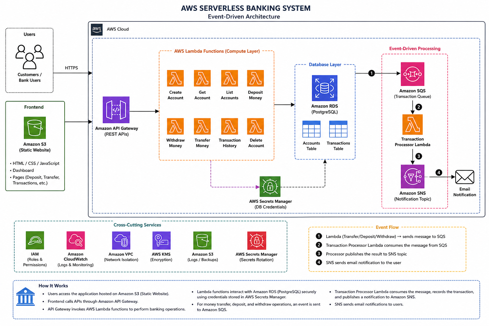
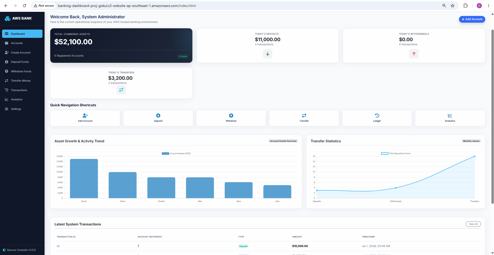
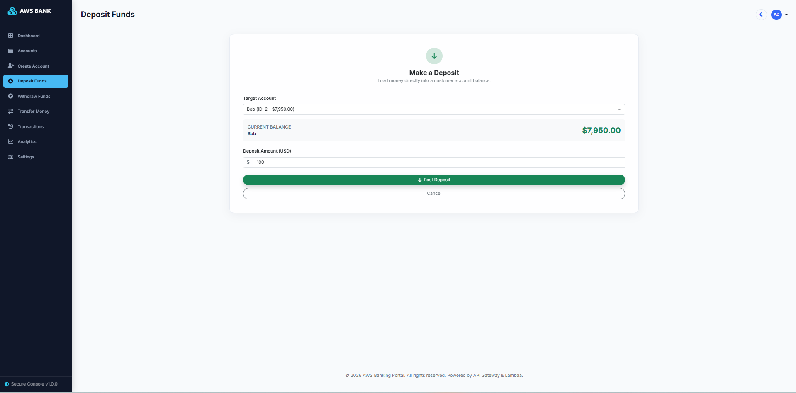
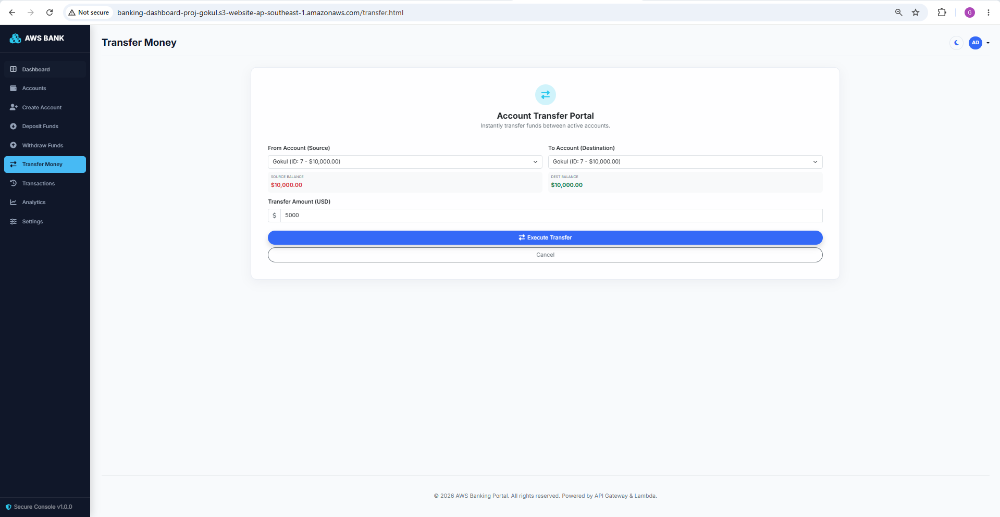
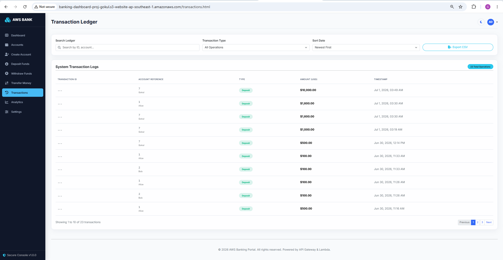
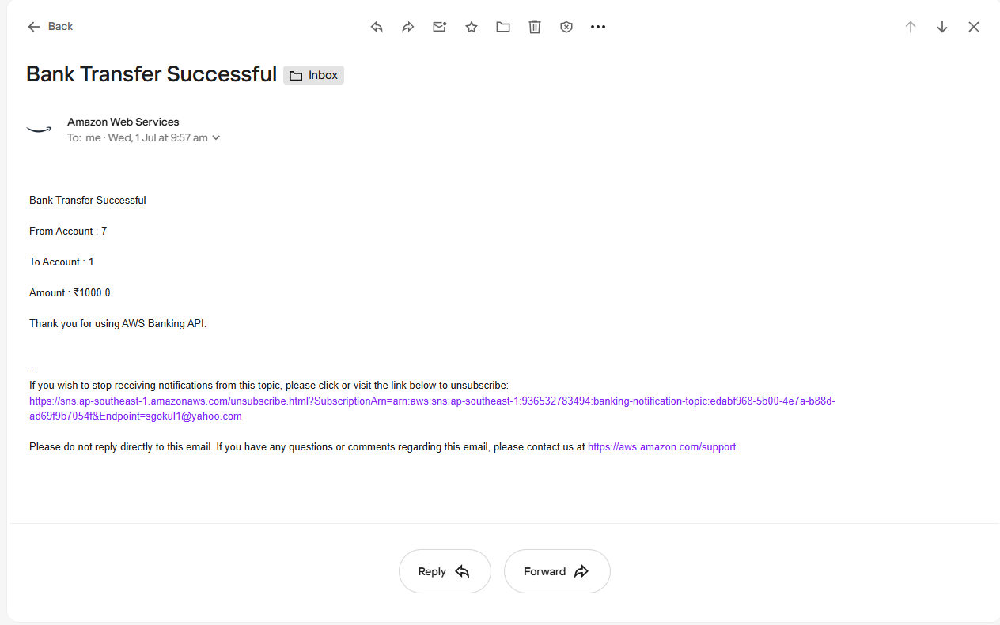
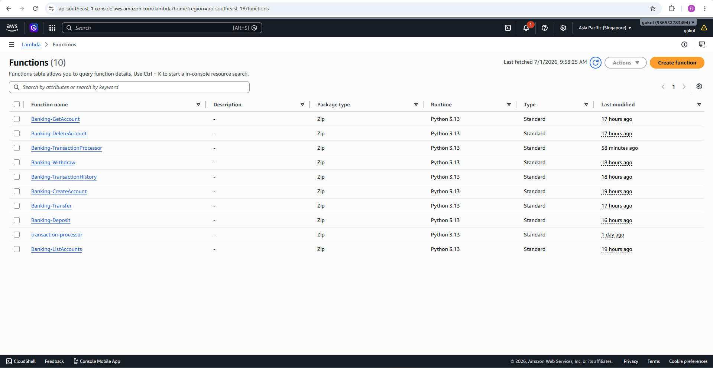
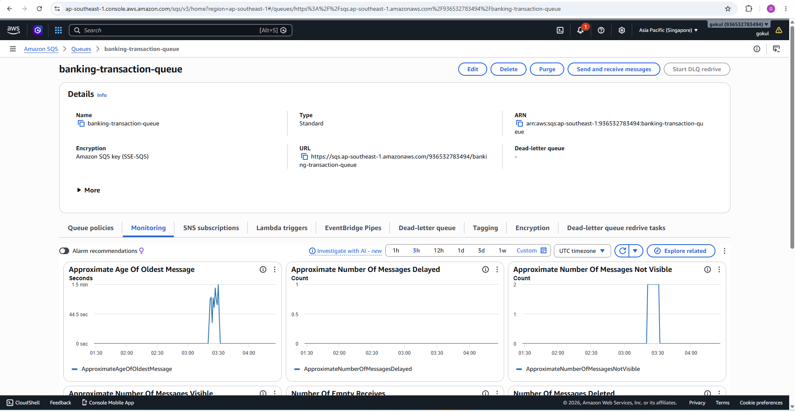
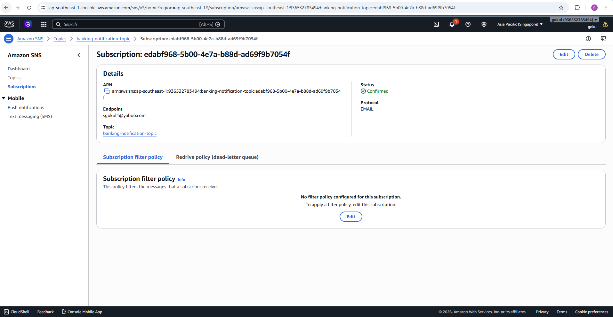
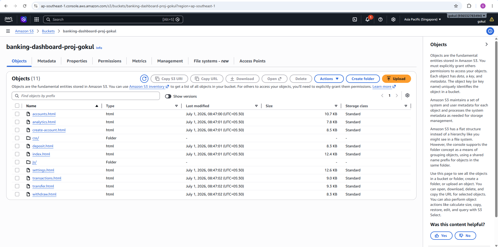

# AWS Serverless Banking System

A cloud-native banking application demonstrating secure transaction processing using AWS Serverless services.

## Dashboard

---

# Architecture

API Gateway

↓

AWS Lambda

↓

Amazon RDS PostgreSQL

↓

Amazon SQS

↓

Transaction Processor Lambda

↓

Amazon SNS

↓

Email Notification

---

# Features

✅ Create Account

✅ Deposit Money

✅ Withdraw Money

✅ Transfer Money

✅ Transaction History

✅ Dashboard Analytics

✅ Event-Driven Processing

✅ Email Notifications

---

# AWS Services

- Amazon API Gateway
- AWS Lambda
- Amazon RDS PostgreSQL
- Amazon SQS
- Amazon SNS
- AWS Secrets Manager
- Amazon S3
- IAM
- Amazon CloudWatch

---

# Tech Stack

- HTML
- CSS
- JavaScript
- PostgreSQL
- AWS

---

# Screenshots

## Dashboard

---

## Deposit

---

## Transfer

---

## Transaction History

---

## SNS Email Notification

---

## Lambda

---

## Amazon SQS

---

## Amazon SNS

---

## Amazon S3 Website Hosting

---

# API Endpoints

| Method | Endpoint |
|---------|----------|
| GET | /accounts |
| POST | /accounts |
| PUT | /accounts/{id}/deposit |
| PUT | /accounts/{id}/withdraw |
| POST | /transfer |
| GET | /transactions/{id} |
| DELETE | /accounts/{id} |

---

# Future Improvements

- AWS Step Functions
- Amazon Cognito
- Terraform
- CloudFront
- Route53
- GitHub Actions CI/CD
- Docker
- Kubernetes

---

# Author

**Gokul S**

AWS Certified Solutions Architect – Associate
